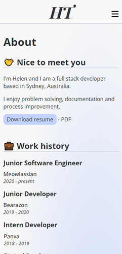

This repository was submitted as an assignment for [Coder Academy](https://coderacademy.edu.au/)'s full stack web development coding bootcamp.

# T1A2 - Portfolio

## Overview

The assignment required a portfolio website to be created, which represents myself as a developer.

You can view the deployed site at [14310.netlify.app](https://14310.netlify.app/).

### Disclaimer

Please note that the information and links on the site are currently populated with placeholders. The website was initially created as my first repository and served as a canvas to experiment with. The details provided are also fictional and intended only for the purposes of the assignment.

## Tech stack

           

## Sitemap

The site consists of 4 pages, set up in a simple structure.

The Home page (index.html) acts as the landing page once a user arrives to the site.

Other pages include the About page (about.html), Blog page (blog.html) and Work page (work.html).

From any page, the user can navigate to the other pages using the navigation menu.
Note: The navigation appears as a sidebar for mobile and tablet viewports, and as a top navigation bar for desktop viewports.

Users can also find quick links in the footer to professional resources such as GitHub, LinkedIn and a downloadable resume (PDF).

## Common page structure

- Header allows users to navigate back to the Home page regardless of which page they're currently on.

- Navigation bar / menu allows users to navigate to any subpage regardless of which page they're currently on.

- Footer provides quick access to name, email and professional links such as GitHub,
LinkedIn and a downloadable resume.

## File overview

## Screenshots

### Home page

### About page

### Blog page

### Work page

